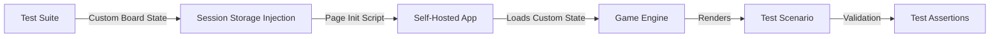
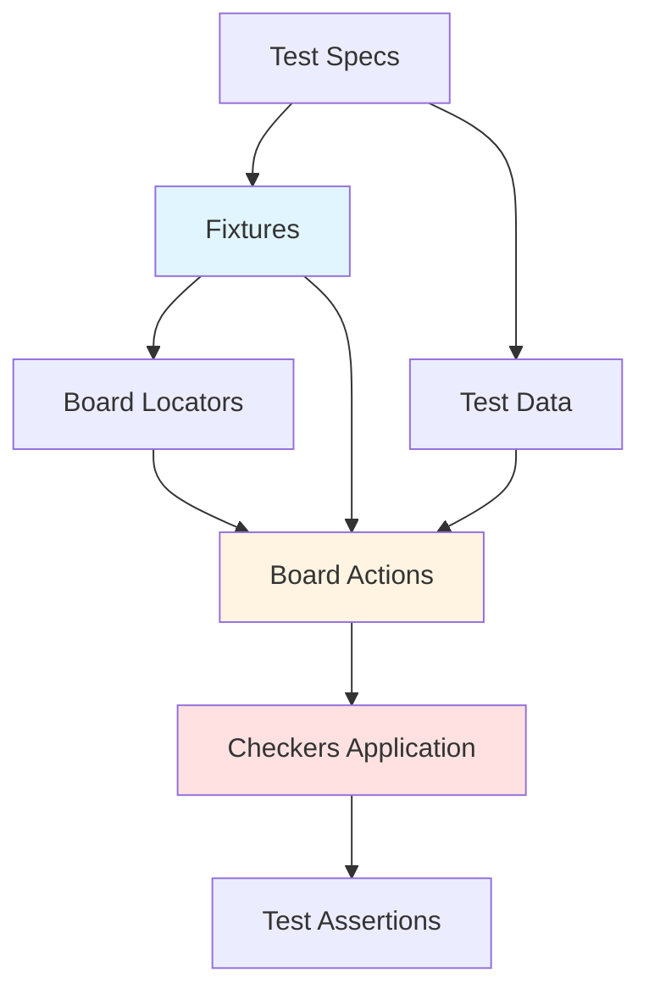
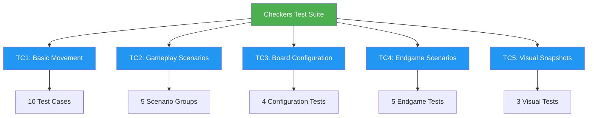
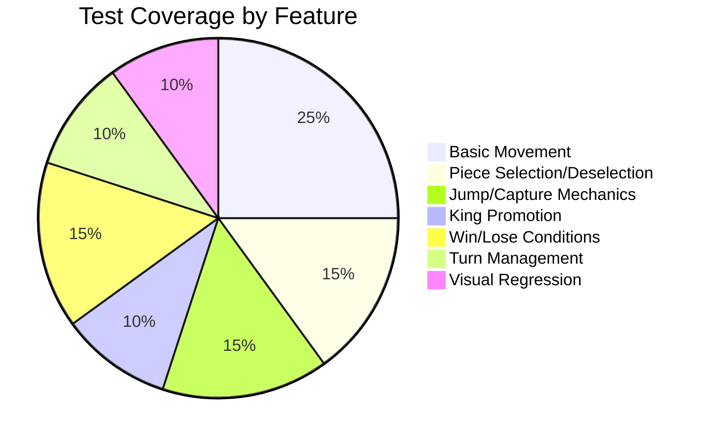
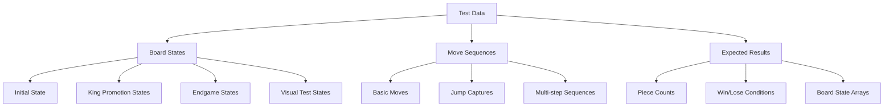
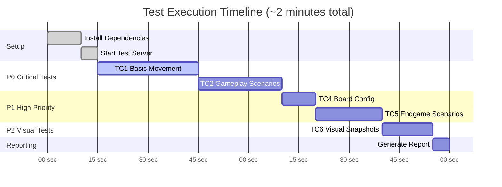
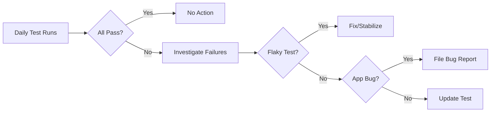

# Test Plan: Checkers Game Application

**Application Under Test:** Checkers Game (English Draughts)
**Project:** CheckTester
**Version:** 1.1
**Prepared By:** James Kip
**Last Updated:** 2025-11-08

---

## Executive Summary

This document outlines the comprehensive test strategy and test cases for a browser-based **Checkers Game Application** (English Draughts). The application allows players to compete against a computer opponent in a classic 8x8 checkers game with standard rules including piece movement, captures, king promotions, and win/lose conditions.

**Application Overview:**
- **Type:** Browser-based game (HTML/CSS/JavaScript)
- **Gameplay:** Player (orange pieces) vs Computer (blue pieces)
- **Rules:** English Draughts standard rules
- **Technology:** Static HTML with vanilla JavaScript game engine

**Test Approach Highlights:**
- **Comprehensive game rule validation** - All English Draughts rules tested
- **Self-hosted application setup** - Enables programmatic board state control for testing edge cases
- **27 test scenarios** covering piece movement, captures, promotions, and endgame situations
- **Visual regression testing** - Ensures UI consistency across builds
- **Automated execution** - Playwright-based E2E testing with TypeScript

---

## 1. Test Strategy

### 1.1 Testing Approach

Our testing strategy employs a **hybrid approach** combining:
- **Functional E2E Testing**: Validating game rules, piece movements, and win conditions
- **Visual Regression Testing**: Detecting unintended UI changes through screenshot comparison
- **State-Based Testing**: Testing edge cases and complex scenarios using custom board configurations

### 1.2 Self-Hosted Application & Programmatic State Control

**Critical Testing Strategy**: The checkers game application has been self-hosted (rather than testing against a remote URL) to enable **programmatic board state control**.



**Why This Matters:**

Testing a checkers game presents unique challenges:
- **Long Test Setup**: Reaching endgame scenarios (e.g., king vs king) requires dozens of moves
- **AI Unpredictability**: Computer opponent’s random moves make tests non-deterministic
- **Edge Case Access**: Specific board configurations (e.g., multi-jump opportunities) are hard to reach naturally

**Solution**: By self-hosting and injecting custom board states, we can:
- **Test Specific Scenarios**: Start tests with exact board positions (e.g., “orange piece at row 6, one move from king promotion”)
- **Achieve Determinism**: Eliminate AI randomness by setting up precise positions
- **Reduce Test Time**: ~10 seconds per test vs. ~5 minutes to manually play to that state
- **Expand Coverage**: Test rare edge cases that may never occur in random gameplay

**Implementation**: Custom test fixture ([fixtures.ts:14-20](tests/fixtures.ts#L14-L20)) injects board state into the game’s `sessionStorage` before page load, allowing the game engine to initialize with our desired configuration.

### 1.3 Test Architecture



**Architectural Components:**
- **Fixtures** ([fixtures.ts](tests/fixtures.ts)): Custom board state injection, page setup/teardown
- **Locators** ([board.locators.ts](tests/board/locators/board.locators.ts)): Centralized element selectors
- **Actions** ([board.actions.ts](tests/board/actions/board.actions.ts)): High-level game interaction methods
- **Data** ([board.data.ts](tests/board/data/board.data.ts)): Game states, constants, type definitions

---

## 2. Scope & Objectives

### 2.1 In Scope

| **Category** | **Description** |
| --- | --- |
| **Game Mechanics** | All piece movement rules, jump captures, king promotions, turn alternation |
| **Game Rules Enforcement** | Valid/invalid move detection, diagonal-only movement, forward-only for non-kings |
| **Win/Lose Conditions** | Player wins by capturing all blue pieces, computer wins by capturing all orange pieces |
| **UI Feedback** | Piece selection visual feedback, game messages, piece sprite changes |
| **Board Configurations** | Initial 8x8 setup, mid-game scenarios, endgame situations, edge cases |
| **Visual Consistency** | Board rendering accuracy, piece sprite display, layout integrity across scenarios |

### 2.2 Out of Scope

- **Performance Testing**: Game rendering speed, memory usage during long games
- **Cross-Browser Compatibility**: Testing limited to Chromium (Chrome browser); Firefox/Safari not covered
- **Mobile/Responsive Design**: Touch interactions and mobile layout not tested
- **Accessibility (a11y)**: Screen reader compatibility, keyboard navigation not validated
- **Security Testing**: XSS, injection attacks not in scope for this release
- **Multiplayer Features**: Application is single-player only (player vs computer AI)

### 2.3 Test Objectives

1.  Validate 100% compliance with English Draughts rules
2.  Ensure deterministic game state management
3.  Verify UI provides clear feedback for all player actions
4.  Prevent regression in visual presentation
5.  Validate edge cases and endgame scenarios

---

## 3. Test Environment

### 3.1 Technical Stack

| **Component** | **Technology** | **Version** |
| --- | --- | --- |
| **Application Under Test** | Checkers Game (HTML/JS/CSS) | N/A (static) |
| **Application Server** | npx serve | Port 3000 (localhost) |
| **Test Automation Tool** | Playwright | ^1.56.1 |
| **Test Language** | TypeScript | ^5.9.3 |
| **Test Browser** | Chromium (Desktop Chrome) | Latest |
| **Test Runtime** | Node.js | v22+ |

### 3.2 Test Execution Configuration

```json
// playwright.config.ts
{
  testDir: './tests',
  fullyParallel: true,
  retries: CI ? 2 : 0,
  reporter: ['list', 'html'],
  baseURL: 'http://localhost:3000',
  trace: 'on-first-retry',
  screenshot: 'only-on-failure'
 }
```

---

## 4. Test Cases

### 4.1 Test Suite Structure



---

### TC1: Basic Piece Selection and Movement

**Test File:** [basic-movement.spec.ts](tests/board/specs/basic-movement.spec.ts)
**Priority:** P0 (Critical)
**Objective:** Validate core game mechanics and user interactions

### TC1.1: Initial Game State Verification

```gherkin
Feature: Initial Board Setup
  As a player
  I want to start with a properly configured board
  So that the game follows standard checkers rules

  Scenario: Verify initial board state
    Given the checkers game loads
    When I observe the board
    Then I should see 12 orange pieces on rows 0-2
    And I should see 12 blue pieces on rows 5-7
    And I should see the message "Select an orange piece"
    And all pieces should be in non-king state
```

**Implementation:** [basic-movement.spec.ts:26-30](tests/board/specs/basic-movement.spec.ts#L26-L30)

### TC1.2: Piece Selection and Deselection

```gherkin
Feature: Piece Selection
  As a player
  I want to select and deselect my pieces
  So that I can plan my moves

  Scenario: Select an orange piece successfully
    Given the game is in initial state
    When I click on an orange piece at position (0,2)
    Then the piece should display selected state (you2.gif)
    And the piece should be visually highlighted

  Scenario: Deselect a selected piece
    Given I have selected a piece at position (0,2)
    When I click on the same piece again
    Then the piece should return to normal state (you1.gif)
    And no piece should be highlighted
```

**Implementation:** [basic-movement.spec.ts:34-41](tests/board/specs/basic-movement.spec.ts#L34-L41)

### TC1.3: Visual Selection Feedback

```gherkin
Feature: Selection Visual Feedback
  As a player
  I want clear visual feedback when selecting pieces
  So that I know which piece is active

  Scenario: Switch selection between pieces
    Given I have selected piece at (0,2)
    And the piece displays selected sprite (you2.gif)
    When I select another piece at (2,2)
    Then piece at (0,2) should revert to normal sprite
    And piece at (2,2) should display selected sprite
    And only one piece should be selected at a time
```

**Implementation:** [basic-movement.spec.ts:43-50](tests/board/specs/basic-movement.spec.ts#L43-L50)

### TC1.4: Opponent Piece Protection

```gherkin
Feature: Opponent Piece Selection Prevention
  As a game engine
  I want to prevent players from selecting opponent pieces
  So that game rules are enforced

  Scenario: Attempt to select blue (computer) piece
    Given the game is in initial state
    And it is orange's turn
    When I click on a blue piece at position (1,5)
    Then the piece should not be selected
    And I should see an error message
    And the blue piece should remain in place
```

**Implementation:** [basic-movement.spec.ts:52-57](tests/board/specs/basic-movement.spec.ts#L52-L57)

### TC1.5: Valid Diagonal Movement

```gherkin
Feature: Diagonal Movement
  As a player
  I want to move pieces diagonally forward
  So that I can advance toward the opponent's side

  Scenario: Perform valid diagonal move
    Given I have an orange piece at position (0,2)
    When I select the piece
    And I click on square (1,3)
    Then the piece should move to position (1,3)
    And position (0,2) should be empty
    And the board state should match expected state after first move
    And the game should continue (not game over)
```

**Implementation:** [basic-movement.spec.ts:61-67](tests/board/specs/basic-movement.spec.ts#L61-L67)

### TC1.6: Multiple Consecutive Moves

```gherkin
Feature: Sequential Move Execution
  As a player
  I want to execute multiple moves in sequence
  So that I can progress through the game

  Scenario: Execute all valid moves in sequence
    Given the game is in initial state
    When I execute move 1: (0,2) => (1,3)
    And the computer makes its move (if game continues)
    And I execute move 2: (2,2) => (3,3)
    And the computer makes its move (if game continues)
    And I execute move 3: (4,2) => (5,3)
    Then moves should be executed until game ends or all moves complete
    And the game state should be valid
```

**Implementation:** [basic-movement.spec.ts:69-80](tests/board/specs/basic-movement.spec.ts#L69-L80)

### TC1.7: Invalid Backward Move Handling

```gherkin
Feature: Invalid Move Prevention
  As a game engine
  I want to reject invalid moves
  So that game rules are maintained

  Scenario: Attempt backward move (non-king piece)
    Given I have selected a piece at position (0,2)
    When I click on square (1,1) (backward diagonal)
    Then the piece should remain at position (0,2)
    And no movement should occur
```

**Implementation:** [basic-movement.spec.ts:84-91](tests/board/specs/basic-movement.spec.ts#L84-L91)

### TC1.8: Invalid Move to Occupied Square

```gherkin
Feature: Invalid Move Prevention
  As a game engine
  I want to reject moves to occupied squares
  So that game rules are maintained

  Scenario: Attempt move to occupied square
    Given I have selected a piece at position (0,2)
    When I click on square (2,2) (occupied by orange piece)
    Then the piece should remain at position (0,2)
    And no capture should occur (same color)
```

**Implementation:** [basic-movement.spec.ts:93-98](tests/board/specs/basic-movement.spec.ts#L93-L98)

### TC1.9: Game State After Valid Move

```gherkin
Feature: Game State Consistency
  As a game engine
  I want to maintain game state after valid moves
  So that state integrity is maintained

  Scenario: Verify state after player move
    Given I complete a move from (0,2) to (1,3)
    Then the game should NOT be over
    And piece counts should remain 12 orange, 12 blue
    And game should be in progress
```

**Implementation:** [basic-movement.spec.ts:102-107](tests/board/specs/basic-movement.spec.ts#L102-L107)

### TC1.10: Blue Piece Count Maintenance

```gherkin
Feature: Piece Count Integrity
  As a game engine
  I want to maintain accurate piece counts
  So that the game state is correct

  Scenario: Verify blue pieces unchanged after orange non-capturing move
    Given the game is in initial state
    When I move an orange piece from (0,2) to (1,3)
    Then blue piece count should be 12
    And the game should be in progress
```

**Implementation:** [basic-movement.spec.ts:109-117](tests/board/specs/basic-movement.spec.ts#L109-L117)

---

### TC2: Common Gameplay Scenarios

**Test File:** [gameplay-scenarios.spec.ts](tests/gameplay/specs/gameplay-scenarios.spec.ts)
**Data File:** [gameplay.data.ts](tests/gameplay/data/gameplay.data.ts)
**Priority:** P0 (Critical)
**Objective:** Validate common game situations and mechanics

### TC2.1: Basic Piece Movement

```gherkin
Feature: Basic Piece Movement
  As a player
  I want to move pieces forward diagonally
  So that I can play the game

  Scenario: Execute basic piece movement successfully
    Given the board is in initial state
    And I have 12 orange pieces
    And I have 12 blue pieces
    When I move piece from (0,2) to (1,3)
    Then the move should succeed
    And orange piece count should be 12
    And blue piece count should be 12
    And the game should NOT be over
```

**Implementation:** [gameplay-scenarios.spec.ts:6-30](tests/gameplay/specs/gameplay-scenarios.spec.ts#L6-L30)
**Data:** [gameplay.data.ts:6-19](tests/gameplay/data/gameplay.data.ts#L6-L19)

### TC2.2: Game State Consistency

```gherkin
Feature: Game State Consistency
  As a game engine
  I want to maintain consistent state throughout play
  So that the game behaves predictably

  Scenario: Maintain game state consistency throughout play
    Given the board is in initial state
    When I execute a move from (0,2) to (1,3)
    Then the game state should remain consistent
    And piece counts should be accurate (12, 12)
    And the game should continue
```

**Implementation:** [gameplay-scenarios.spec.ts:6-30](tests/gameplay/specs/gameplay-scenarios.spec.ts#L6-L30)
**Data:** [gameplay.data.ts:21-34](tests/gameplay/data/gameplay.data.ts#L21-L34)

### TC2.3: King Promotion

```gherkin
Feature: King Promotion
  As a player
  I want my pieces to become kings when reaching the opposite end
  So that they gain enhanced movement capabilities

  Scenario: Orange piece promoted to king when reaching row 7
    Given I have an orange piece at (2,6)
    And I have an orange piece at (0,0)
    And I have a blue piece at (7,7)
    When I move the piece from (2,6) to (1,7)
    Then the piece at (1,7) should become a king
    And the king sprite (you1k.gif) should be displayed
    And orange piece count should be 2
    And blue piece count should be 1
    And the game should continue
```

**Implementation:** [gameplay-scenarios.spec.ts:6-30](tests/gameplay/specs/gameplay-scenarios.spec.ts#L6-L30)
**Data:** [gameplay.data.ts:36-49](tests/gameplay/data/gameplay.data.ts#L36-L49)

### TC2.4: Jump Capture Mechanics

```gherkin
Feature: Jump Capture
  As a player
  I want to capture opponent pieces by jumping over them
  So that I can eliminate opponent pieces

  Scenario: Orange piece captures blue piece via jump
    Given I have an orange piece at (0,2)
    And I have an orange piece at (4,2)
    And I have a blue piece at (1,3)
    And I have a blue piece at (6,6)
    When I jump from (0,2) to (2,4)
    Then the blue piece at (1,3) should be captured
    And the blue piece should be removed from the board
    And orange pieces should be 2
    And blue pieces should be 2 (one captured piece removed)
    And the game should continue
```

**Implementation:** [gameplay-scenarios.spec.ts:6-30](tests/gameplay/specs/gameplay-scenarios.spec.ts#L6-L30)
**Data:** [gameplay.data.ts:51-65](tests/gameplay/data/gameplay.data.ts#L51-L65)

### TC2.5: Multiple Sequential Moves

```gherkin
Feature: Multiple Sequential Moves
  As a test suite
  I want to execute multiple moves in sequence
  So that I can test game flow

  Scenario: Execute multiple moves to test game flow
    Given I have 3 orange pieces at (0,2), (2,2), (4,2)
    And I have 2 blue pieces at (1,5), (3,5)
    When I move from (0,2) to (1,3)
    Then the move should succeed
    And orange pieces should be 3
    And blue pieces should be 2
    And the game should continue
```

**Implementation:** [gameplay-scenarios.spec.ts:6-30](tests/gameplay/specs/gameplay-scenarios.spec.ts#L6-L30)
**Data:** [gameplay.data.ts:67-92](tests/gameplay/data/gameplay.data.ts#L67-L92)

---

### TC3: Board State Configuration Examples

**Test File:** [board-configuration.spec.ts](tests/board/specs/board-configuration.spec.ts)
**Priority:** P1 (High)
**Objective:** Validate custom board state injection and edge case scenarios

### TC3.1: King Promotion Scenario Setup

```gherkin
Feature: Custom Board State - King Promotion
  As a test engineer
  I want to inject custom board states
  So that I can test specific scenarios without manual setup

  Scenario: Verify custom king promotion board state
    Given I inject a custom board state with:
      | Position | Piece        | Type   |
      | (2,6)    | Orange       | Normal |
      | (0,0)    | Orange       | Normal |
      | (7,7)    | Blue         | Normal |
    When the game loads
    Then I should see orange piece at (2,6) as normal
    And I should see orange piece at (0,0) as normal
    And I should see blue piece at (7,7) as normal
    And orange count should be 2
    And blue count should be 1
```

**Implementation:** [board-configuration.spec.ts:14-16](tests/board/specs/board-configuration.spec.ts#L14-L16)

### TC3.1.1: King Promotion Move Execution

```gherkin
Feature: King Promotion Move
  As a player
  I want to promote my piece to a king
  So that it gains bidirectional movement

  Scenario: Execute promotion move on custom board
    Given the custom king promotion board state
    When I move orange piece from (2,6) to (1,7)
    Then position (2,6) should be empty
    And the piece at (1,7) should be promoted to king
    And orange piece count should still be > 0 (promotion, not creation)
```

**Implementation:** [board-configuration.spec.ts:18-24](tests/board/specs/board-configuration.spec.ts#L18-L24)

### TC3.2: Minimal Endgame Scenario

```gherkin
Feature: Custom Board State - Endgame
  As a test engineer
  I want to test endgame scenarios
  So that I can validate win/lose conditions

  Scenario: Verify minimal endgame board setup
    Given I inject a custom endgame board state with:
      | Position | Piece  | Type   |
      | (0,0)    | Orange | King   |
      | (2,2)    | Orange | Normal |
      | (7,7)    | Blue   | King   |
    When the game loads
    Then orange piece at (0,0) should be a king
    And orange piece at (2,2) should be normal
    And blue piece at (7,7) should be a king
    And orange count should be 2
    And blue count should be 1
```

**Implementation:** [board-configuration.spec.ts:32-34](tests/board/specs/board-configuration.spec.ts#L32-L34)

### TC3.3: Default Board Validation

```gherkin
Feature: Default Game Initialization
  As a player
  I want the game to start with standard checkers setup
  So that I can play a normal game

  Scenario: Load game with default initial state
    Given I navigate to the checkers game
    And no custom board state is provided
    When the game loads
    Then I should see 12 orange pieces in starting positions (rows 0-2)
    And I should see 12 blue pieces in starting positions (rows 5-7)
    And the board should display standard 8x8 checkers configuration
```

**Implementation:** [board-configuration.spec.ts:38-40](tests/board/specs/board-configuration.spec.ts#L38-L40)

---

### TC4: Endgame Scenarios

**Test File:** [endgame-scenarios.spec.ts](tests/gameplay/specs/endgame-scenarios.spec.ts)
**Data File:** [endgame.data.ts](tests/gameplay/data/endgame.data.ts)
**Priority:** P1 (High)
**Objective:** Validate endgame logic, win conditions, and complex king movements

### TC4.1: King vs King Duel

```gherkin
Feature: King vs King Endgame
  As a game engine
  I want to handle king-only endgames correctly
  So that strategic maneuvering is possible

  Scenario: Single king vs single king strategic maneuvering
    Given I have 1 orange king at (0,2)
    And I have 1 blue king at (6,4)
    When I move orange king from (0,2) to (1,1)
    Then the move should succeed
    And orange pieces should be 1
    And blue pieces should be 1
    And the game should continue (no winner)
```

**Implementation:** [endgame-scenarios.spec.ts:6-24](tests/gameplay/specs/endgame-scenarios.spec.ts#L6-L24)
**Data:** [endgame.data.ts:5-23](tests/gameplay/data/endgame.data.ts#L5-L23)

### TC4.2: King Hunt Scenario

```gherkin
Feature: King Hunt Victory
  As a player
  I want to win by capturing the last opponent piece with a king
  So that the game correctly identifies victory

  Scenario: Orange king captures last blue piece to win
    Given I have 1 orange king at (3,5)
    And I have 1 orange normal piece at (0,4)
    And I have 1 blue normal piece at (4,6)
    When I jump from (3,5) to (5,7) capturing piece at (4,6)
    Then the blue piece at (4,6) should be captured
    And blue pieces should be 0
    And the game should declare orange as winner
```

**Implementation:** [endgame-scenarios.spec.ts:6-24](tests/gameplay/specs/endgame-scenarios.spec.ts#L6-L24)
**Data:** [endgame.data.ts:24-44](tests/gameplay/data/endgame.data.ts#L24-L44)

### TC4.3: Final Pieces Scenario

```gherkin
Feature: Few Pieces Remaining
  As a game engine
  I want to handle scenarios with few pieces correctly
  So that the game continues until a winner is determined

  Scenario: Continue game with 2v2 pieces
    Given I have 2 orange pieces at (0,2) and (4,2)
    And I have 2 blue pieces at (2,4) and (6,6)
    When the board is loaded
    Then orange pieces should be 2
    And blue pieces should be 2
    And the game should continue (no winner yet)
```

**Implementation:** [endgame-scenarios.spec.ts:6-24](tests/gameplay/specs/endgame-scenarios.spec.ts#L6-L24)
**Data:** [endgame.data.ts:45-62](tests/gameplay/data/endgame.data.ts#L45-L62)

### TC4.4: Orange Victory Scenario

```gherkin
Feature: Player Victory Detection
  As a game engine
  I want to detect when the player wins
  So that the game ends correctly

  Scenario: Orange king captures last blue piece to win
    Given I have 1 orange king at (3,3)
    And I have 1 blue normal piece at (4,4)
    When I jump from (3,3) to (5,5) capturing piece at (4,4)
    Then the blue piece at (4,4) should be captured
    And blue pieces should be 0
    And the game should display "You won" message
    And the game should be over with orange as winner
```

**Implementation:** [endgame-scenarios.spec.ts:6-24](tests/gameplay/specs/endgame-scenarios.spec.ts#L6-L24)
**Data:** [endgame.data.ts:63-82](tests/gameplay/data/endgame.data.ts#L63-L82)

### TC4.5: Blue Victory Scenario

```gherkin
Feature: Computer Victory Detection
  As a game engine
  I want to detect when the computer wins
  So that the game ends correctly

  Scenario: Blue king captures last orange piece to win
    Given I have 1 orange normal piece at (4,4)
    And I have 1 blue king at (2,6)
    When I move orange piece from (4,4) to (3,5)
    And the computer captures the last orange piece
    Then orange pieces should be 0
    And the game should display "You lose" message
    And the game should be over with blue as winner
```

**Implementation:** [endgame-scenarios.spec.ts:6-24](tests/gameplay/specs/endgame-scenarios.spec.ts#L6-L24)
**Data:** [endgame.data.ts:83-103](tests/gameplay/data/endgame.data.ts#L83-L103)

---

### TC5: Visual Snapshot Tests

**Test File:** [visual-snapshot.spec.ts](tests/visual/specs/visual-snapshot.spec.ts)
**Data File:** [visual.data.ts](tests/visual/data/visual.data.ts)
**Priority:** P2 (Medium)
**Objective:** Prevent visual regressions through screenshot comparison

### TC5.1: Scattered Pieces Scenario

```gherkin
Feature: Visual Regression - Scattered Layout
  As a QA engineer
  I want to capture visual snapshots of various board states
  So that UI changes are detected

  Scenario: Capture scattered pieces board layout
    Given I have 4 orange pieces scattered across the board:
      | Position | Type   |
      | (0,2)    | Normal |
      | (4,4)    | King   |
      | (6,0)    | Normal |
      | (2,6)    | Normal |
    And I have 4 blue pieces scattered:
      | Position | Type   |
      | (1,1)    | Normal |
      | (3,5)    | King   |
      | (7,3)    | Normal |
      | (5,7)    | Normal |
    When the board is rendered
    Then a full-page screenshot should match baseline "scattered-pieces-board.png"
```

**Implementation:** [visual-snapshot.spec.ts:5-16](tests/visual/specs/visual-snapshot.spec.ts#L5-L16)
**Data:** [visual.data.ts:5-25](tests/visual/data/visual.data.ts#L5-L25)

### TC5.2: Mixed Pieces Scenario

```gherkin
Feature: Visual Regression - Mixed Piece Types
  As a QA engineer
  I want to validate rendering of mixed normal and king pieces
  So that sprite rendering is correct

  Scenario: Capture mixed normal and king pieces layout
    Given I have 5 orange pieces with mixed types:
      | Position | Type   |
      | (0,6)    | Normal |
      | (2,4)    | King   |
      | (6,2)    | Normal |
      | (4,0)    | Normal |
      | (0,0)    | King   |
    And I have 4 blue pieces with mixed types:
      | Position | Type   |
      | (7,1)    | Normal |
      | (1,3)    | Normal |
      | (5,5)    | King   |
      | (3,7)    | Normal |
    When the board is rendered
    Then a game wrapper screenshot should match baseline "mixed-pieces-board.png"
```

**Implementation:** [visual-snapshot.spec.ts:5-16](tests/visual/specs/visual-snapshot.spec.ts#L5-L16)
**Data:** [visual.data.ts:26-47](tests/visual/data/visual.data.ts#L26-L47)

### TC5.3: Asymmetric Endgame Scenario

```gherkin
Feature: Visual Regression - Asymmetric Endgame
  As a QA engineer
  I want to validate complex endgame board rendering
  So that piece density variations render correctly

  Scenario: Capture asymmetric endgame layout (3 orange vs 6 blue)
    Given I have 3 orange pieces:
      | Position | Type   |
      | (2,0)    | King   |
      | (6,4)    | Normal |
      | (0,4)    | Normal |
    And I have 6 blue pieces:
      | Position | Type   |
      | (1,7)    | King   |
      | (5,7)    | King   |
      | (3,5)    | Normal |
      | (7,5)    | Normal |
      | (1,3)    | Normal |
      | (5,1)    | Normal |
    When the board is rendered
    Then a game wrapper screenshot should match baseline "asymmetric-endgame.png"
```

**Implementation:** [visual-snapshot.spec.ts:5-16](tests/visual/specs/visual-snapshot.spec.ts#L5-L16)
**Data:** [visual.data.ts:48-69](tests/visual/data/visual.data.ts#L48-L69)

---

## 5. Test Coverage Analysis

### 5.1 Coverage by Game Feature



### 5.2 Test Distribution

| **Test Suite** | **# of Tests** | **Priority** | **Execution Time** |
| --- | --- | --- | --- |
| TC1: Basic Movement | 10 | P0 | ~35s |
| TC2: Gameplay Scenarios | 5 | P0 | ~25s |
| TC3: Board Configuration | 4 | P1 | ~15s |
| TC4: Endgame Scenarios | 5 | P1 | ~20s |
| TC5: Visual Snapshots | 3 | P2 | ~15s |
| **Total (1 runner)** | **27** | - | **~110s** |

### 5.3 Game Rule Coverage

| **Checkers Rule** | **Test Coverage** | **Implementation** |
| --- | --- | --- |
| Diagonal-only movement |  100% | TC1.3, TC1.5 |
| Forward movement (non-king) |  100% | TC1.5 |
| Jump to capture |  100% | TC2.4, TC4.2, TC4.4 |
| King promotion at row 7 |  100% | TC2.3, TC3.1 |
| King bidirectional movement |  80% | TC4.1, TC4.2 |
| Turn alternation |  100% | TC1.6, TC1.7 |
| Win by capturing all pieces |  100% | TC4.2, TC4.4, TC4.5 |
| Multiple jumps (chain) | L 0% | **Gap Identified** |
| Forced jump rule | L 0% | **Gap Identified** |

**Identified Gaps:**
1. **Multiple/Chain Jumps**: No test validates consecutive jumps in a single turn
2. **Forced Jump Rule**: No test validates mandatory capture when available

---

## 6. Test Data Management

### 6.1 Data Organization



### 6.2 Test Data Files

| **File** | **Purpose** | **Records** |
| --- | --- | --- |
| [board.data.ts](tests/board/data/board.data.ts) | Constants, types, base states | 5 states |
| [gameplay.data.ts](tests/gameplay/data/gameplay.data.ts) | Common gameplay scenarios | 5 scenarios |
| [endgame.data.ts](tests/gameplay/data/endgame.data.ts) | Endgame and victory scenarios | 5 scenarios |
| [visual.data.ts](tests/visual/data/visual.data.ts) | Visual snapshot configurations | 3 scenarios |

---

## 7. Test Execution Plan

### 7.1 Execution Strategy



### 7.2 Execution Commands

```bash
# Run all tests
npm test
# Run specific test suite
npm test tests/board/basic-movement.spec.ts
# Run with UI mode (debugging)
npm run test:ui
# Run in headed mode (visible browser)
npm run test:headed
# Generate and view HTML report
npm run test:report
```

### 7.3 CI/CD Integration

```yaml
# Recommended GitHub Actions workflow
name: Playwright Tests
on: [push, pull_request]

jobs:
  test:
    runs-on: ubuntu-latest
    steps:
      - uses: actions/checkout@v3
      - uses: actions/setup-node@v3
        with:
          node-version: 22
      - run: npm ci
      - run: npx playwright install --with-deps
      - run: npm test
      - uses: actions/upload-artifact@v3
        if: failure()
        with:
          name: playwright-report
          path: playwright-report/
```

---

## 8. Risks & Mitigations

### 8.1 Test Risks

| **Risk** | **Impact** | **Probability** | **Mitigation** |
| --- | --- | --- | --- |
| **AI Randomness** | Test flakiness from unpredictable computer moves | Medium |  Mitigated via custom board state injection |
| **Timing Issues** | Race conditions in async operations | Low |  Playwright auto-waiting, explicit waits where needed |
| **Visual Snapshot Drift** | False positives from minor rendering changes | Medium | Use threshold-based comparison, update baselines |
| **Browser Compatibility** | Tests only run on Chromium | Low | Acceptable for current scope (expand if needed) |
| **Test Data Maintenance** | Complex board states hard to maintain | Medium | Centralized data files, board visualization in logs |

### 8.2 Application Risks

| **Risk** | **Detection Method** | **Current Coverage** |
| --- | --- | --- |
| Invalid board states | State validation in fixtures |  Covered |
| Memory leaks (long games) | Not tested | L Gap |
| Performance degradation | Not tested | L Gap |
| Session storage conflicts | Fixture isolation |  Covered |

---

## 9. Entry & Exit Criteria

### 9.1 Entry Criteria

- Test environment setup complete (Node.js, Playwright)
- Application deployed to localhost:3000
- All test dependencies installed
- Baseline screenshots generated for visual tests

### 9.2 Exit Criteria

- All P0 tests passing (100% pass rate)
- All P1 tests passing (minimum 95% pass rate)
- No critical/blocker bugs open
- Code coverage report generated
- Test execution report published

---

## 10. Deliverables

1.  **Automated Test Suite** - 27 test cases across 5 test files
2.  **Test Fixtures** - Custom board state injection framework
3.  **Page Object Model** - Locators, actions, and data modules
4.  **Test Data** - 18 predefined board configurations
5.  **Visual Baselines** - 3 screenshot baselines
6.  **Test Reports** - HTML reports with screenshots on failure
7.  **This Test Plan** - Comprehensive test documentation

---

## 11. Appendices

### A. Board Coordinate System

```

     0   1   2   3   4   5   6   7
   +---+---+---+---+---+---+---+---+
 7 | # | -1| # | -1| # | -1| # | -1|
   +---+---+---+---+---+---+---+---+
 6 | -1| # | -1| # | -1| # | -1| # |
   +---+---+---+---+---+---+---+---+
 5 | # | -1| # | -1| # | -1| # | -1|
   +---+---+---+---+---+---+---+---+
 4 | 0 | # | 0 | # | 0 | # | 0 | # |
   +---+---+---+---+---+---+---+---+
 3 | # | 0 | # | 0 | # | 0 | # | 0 |
   +---+---+---+---+---+---+---+---+
 2 | 1 | # | 1 | # | 1 | # | 1 | # |
   +---+---+---+---+---+---+---+---+
 1 | # | 1 | # | 1 | # | 1 | # | 1 |
   +---+---+---+---+---+---+---+---+
 0 | 1 | # | 1 | # | 1 | # | 1 | # |
   +---+---+---+---+---+---+---+---+

Legend:
  1  = Orange piece (player)
 -1  = Blue piece (computer)
  0  = Empty playable square
  #  = Non-playable square
```

### B. Piece Sprite Reference

| **Piece Type** | **State** | **Sprite File** | **Usage** |
| --- | --- | --- | --- |
| Orange Normal | Default | `you1.gif` | Player piece |
| Orange Normal | Selected | `you2.gif` | When clicked |
| Orange King | Default | `you1k.gif` | After promotion |
| Blue Normal | Default | `me1.gif` | Computer piece |
| Blue Normal | Selected | `me2.gif` | Computer selection |
| Blue King | Default | `me1k.gif` | Computer king |

### C. Key Testing Strategy Decisions

1. **Self-Hosting Strategy**: Hosting the game locally allows programmatic state control via sessionStorage injection
2. **Custom Board State Injection**: Enables testing complex scenarios without manually playing to those states
3. **Session Storage Over URL Parameters**: Cleaner approach for large board state payloads
4. **Data-Driven Test Design**: Separate test data files allow easy addition of new scenarios
5. **Visual Regression Baseline**: Screenshot comparison detects unintended UI changes in the game

---

## 12. Test Maintenance Plan

### 12.1 Baseline Update Schedule

- **Visual Snapshots**: Review quarterly or after intentional UI changes
- **Test Data**: Review monthly for relevance and coverage gaps
- **Test Cases**: Review after each application release

### 12.2 Test Health Monitoring



---

## 13. Contact & Support

**Test Framework Maintainers:** QA Engineering Team
**Application Under Test:** Checkers Game (English Draughts)
**Documentation Version:** 1.1
**Last Review Date:** 2025-11-08

---

**Document Status:**  Ready for Review
**Next Review Date:** 2025-12-08
